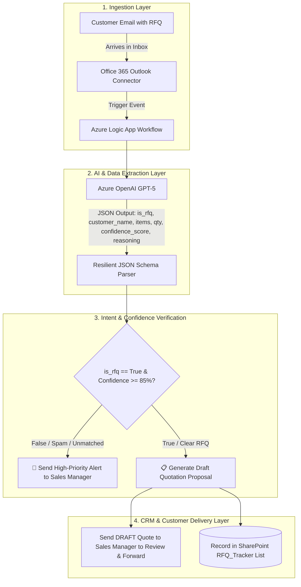

# 🚀 Azure AI-Powered Request for Quotation (RFQ) Automation Engine

[](https://azure.microsoft.com/services/logic-apps/)
[](https://azure.microsoft.com/products/cognitive-services/openai-service)
[](https://www.microsoft.com/sharepoint)
[](https://www.python.org/)

An enterprise-grade, serverless **RFQ Retrieval, Extraction, and Pricing Automation Pipeline** built on **Microsoft Azure AI**, **Logic Apps**, and **Microsoft 365**.

The system automates the ingestion of customer inquiry emails, leverages **Azure OpenAI GPT-5** for semantic intent extraction and spam filtering, maps products to a **SharePoint Catalog**, calculates pricing, records tracking data into a CRM list, and generates draft quotation proposals with built-in confidence scoring and failsafe alerting.

---

## 🏗️ System Architecture



---

## ✨ Key Capabilities

1. **Intelligent Ingestion & Spam Filtering (`is_rfq`)**:
   * Evaluates unstructured email bodies to distinguish genuine commercial RFQs from marketing newsletters, system notices, or general spam.
2. **Semantic Entity Extraction**:
   * Extracts customer names, contact emails, product SKUs, and requested quantities with high precision using `gpt-5`.
3. **AI Confidence Scoring & Plain-Text Reasoning**:
   * Grades every request with a clarity score ($0.0$ to $1.0$) and generates plain-English reasoning for transparent decision-making.
4. **Draft Quotation Workaround (100% Risk-Free)**:
   * Formats proposal emails and routes them directly to the Sales Manager inbox for one-click verification and forwarding.
5. **SharePoint CRM Integration (`RFQ_Tracker`)**:
   * Automatically logs RFQ ID, customer details, calculated totals, next follow-up dates, and confidence scores into SharePoint Online.
6. **Exception & Error Handling Resilience**:
   * Exponential retry policies on API calls with automated admin alerts on service exceptions or schema deviations.

---

## 📁 Repository Structure

```text
├── arm_template_logic_app.json    # 1-Click Azure Resource Manager (ARM) deployment template
├── app.py                         # Local interactive testing web dashboard (Flask)
├── templates/                     # Dashboard HTML templates
│   └── index.html
├── static/                        # Glassmorphic UI styles & frontend JavaScript
│   ├── css/style.css
│   └── js/app.js
├── data/
│   ├── catalog.json               # Master product catalog dataset
│   ├── rfq_database.json          # Mock RFQ database store
│   └── config.example.json        # Configuration template (sanitized)
├── Products_Catalog.xlsx          # Master SharePoint product catalog import file
├── Products_Catalog.csv           # CSV formatted product catalog
├── RFQ_Tracker.xlsx               # SharePoint CRM tracker schema & sample data
├── RFQ_Tracker.csv                # CSV formatted CRM tracker schema
├── rfq_azure_ai_architecture.md   # Complete system architecture specification
├── manual_setup_guide.md          # Step-by-step Azure portal setup guide
├── .gitignore                     # Git ignore rules for keys and cache
└── README.md                      # Project documentation
```

---

## 🚀 Quick Deployment Guide

### Option 1: Deploy to Azure via ARM Template (1-Click)

1. Open the [Azure Portal](https://portal.azure.com).
2. Search for **Deploy a custom template** in the global search bar.
3. Click **Build your own template in the editor**.
4. Copy and paste the contents of [`arm_template_logic_app.json`](./arm_template_logic_app.json).
5. Fill in the parameters:
   * `azureOpenAiEndpoint`: Your Azure OpenAI Endpoint URL.
   * `azureOpenAiKey`: Your Azure OpenAI API Key.
   * `azureOpenAiDeployment`: `gpt-5` (or your model deployment name).
   * `salesManagerEmail`: Target email address for review alerts and draft proposals.
6. Click **Review + Create** $\rightarrow$ **Create**.

---

### Option 2: Run the Local Interactive Demo Dashboard

For offline testing and UI demonstration:

```bash
# 1. Clone the repository
git clone https://github.com/your-username/azure-ai-rfq-automation.git
cd azure-ai-rfq-automation

# 2. Install dependencies
pip install flask openpyxl requests

# 3. Create config file from template
cp data/config.example.json data/config.json
# Edit data/config.json with your Azure OpenAI credentials

# 4. Start local server
python app.py
```
Open `http://localhost:5000` in your browser to access the live test console.

---

## 📊 SharePoint Data Schema

### 1. `Products_Catalog` (Inventory & Pricing)
| Column | Type | Description |
| :--- | :--- | :--- |
| `Title` | Single Line Text | Product Name |
| `SKU` | Single Line Text | Unique Part Number / SKU |
| `UnitPrice` | Currency | Standard List Unit Price |
| `StockLevel` | Number | Real-time Inventory Count |
| `LeadTimeWeeks` | Number | Manufacturing Lead Time in Weeks |

### 2. `RFQ_Tracker` (CRM & Follow-ups)
| Column | Type | Description |
| :--- | :--- | :--- |
| `Title` | Single Line Text | RFQ Tracking ID (`RFQ-YYYYMMDD-HHmm`) |
| `CustomerName` | Single Line Text | Customer Company or Contact Name |
| `ContactEmail` | Single Line Text | Customer Email Address |
| `QuoteTotal` | Currency | Grand Total Quoted Amount |
| `Status` | Choice | `Quote Prepared`, `Quote Sent`, `Pending Approval` |
| `SentDate` | Date/Time | Timestamp when proposal was prepared |
| `NextFollowUpDate` | Date/Time | Scheduled follow-up target date (Today + 3 Days) |
| `ConfidenceScore` | Number | AI Semantic Confidence Rating ($0.0 - 1.0$) |
| `ApprovalReasons` | Multiple Line Text | AI Plain-English Reasoning & Notes |

---

## 🔒 Security & Best Practices

* **Zero Hardcoded Secrets**: All sensitive API keys and connection tokens are managed through parameterization and excluded via `.gitignore`.
* **Managed Identity Ready**: Production implementations can swap API key headers for System-Assigned Managed Identity (`https://cognitiveservices.azure.com/.default`).
* **Human-in-the-Loop Safety**: All outbound customer proposals are staged as review drafts to prevent accidental price leaks or inaccuracies.

---

## 📄 License
This project is open-source and available under the [MIT License](LICENSE).
